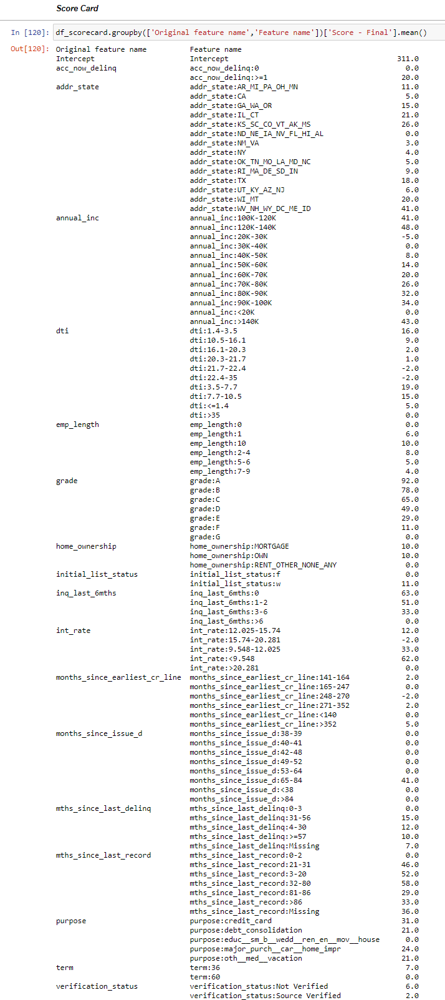

# credit-risk-modeling

## Aim:
The main aim of this project is to explore the dataset and discuss some interesting observations through visualizations and train machine learning models to predict the probabilty of default based on various features using supervised learning.

## Deployment:
I have deployed the model at Heroku. You can have a look: https://abhash-crm.herokuapp.com/

## Dataset:
The dataset contains all available data for more than 800,000 consumer loans issued from 2007 to 2015 by Lending Club: a large US peer-to-peer lending company.
There are several different versions of this dataset. I have used a 1st version but now dataset is not available on kaggle.com
But you can explore the available dataset: https://www.kaggle.com/pragyanbo/a-hitchhiker-s-guide-to-lending-club-loan-data#Understanding-the-data

## Models:
* For PD, I have trained logistic regression
* For LGD, There is two stage approach. 1) Logistic Regression and 2) Linear Regression
* For EAD, I have trained linear regression

## Tools: pandas, scikit-learn, plotly, Flask

## Score Card (FICO Score 300-850):

