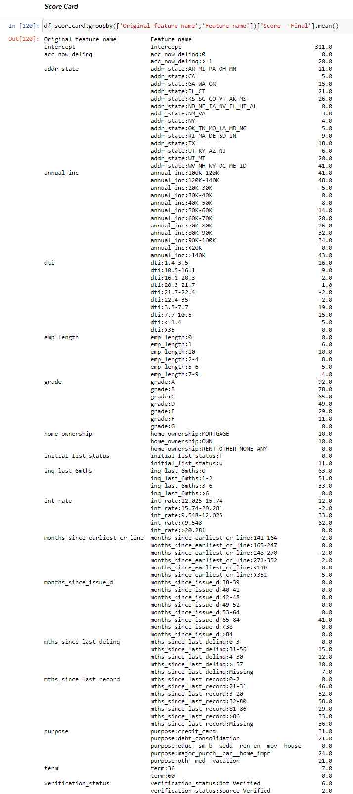

# Credit Risk Modeling using Machine Learning

## Aim:
The main aim of this project is to explore the dataset and discuss some interesting observations through visualizations and train machine learning models to predict the probabilty of default (PD), Loss given default (LGD) and Exposure at default (EAD) based on various features using supervised learning.

<pre>
├── data
│    ├── LCDataDictionary.xlsx (It contain list of all features of dataset)
│    ├── loan_data_2007_2014.csv (Main CSV File)
│    ├── loan_data_2007_2014_preprocessed.csv (File after preprocessing)
│    ├── df_scorecard.csv (It contain coefficient with score card)
├── Models
│    ├── PD Model (pd_model.sav)
│    ├── LGD
|         ├── lgd_model_stage_1.sav (Stage 1 model)
|         ├── lgd_model_stage_2.sav (Stage 2 model)
│    ├── EAD Model (reg_ead.sav)
├── Notebooks
│    ├── Step_1)EDA.ipynb (It contain EDA part)
│    ├── Step_2)Pre-Processing.ipynb (It contain basic preprocessing)
|    ├── Step_3) Pre-Processing for PD Model.ipynb (Preprocessing for PD model)
|    ├── Step_4) Modeling PD Model.ipynb (Modeling PD and Score card)
│    ├── Step_5) Preprocessing for LGD and EAD Models.ipynb (Preprocessing for LGD & EAG)
│    ├── Step_6) LGD and EAD Models.ipynb (Modeling LGD & EAD i.e training models)
│    ├── Step_7) Expected Loss.ipynb (Calculating expected loss)
</pre>

## Deployment:
I have deployed the model at Heroku. You can have a look: https://abhash-crm.herokuapp.com/

## Dataset:
The dataset contains all available data for more than 800,000 consumer loans issued from 2007 to 2015 by Lending Club: a large US peer-to-peer lending company.
There are several different versions of this dataset. I have used a 1st version but now dataset is not available on kaggle.com
But you can explore the available dataset: https://www.kaggle.com/pragyanbo/a-hitchhiker-s-guide-to-lending-club-loan-data#Understanding-the-data

## Models:
* For PD, I have used logistic regression
* For LGD, There is two stage approach. 1) Logistic Regression and 2) Linear Regression
* For EAD, I have trained linear regression

## Tools: pandas, scikit-learn, plotly, Flask
## Credit
I have gained all the knowledge through a course i.e https://www.udemy.com/course/credit-risk-modeling-in-python/
## Score Card (FICO Score 300-850):

